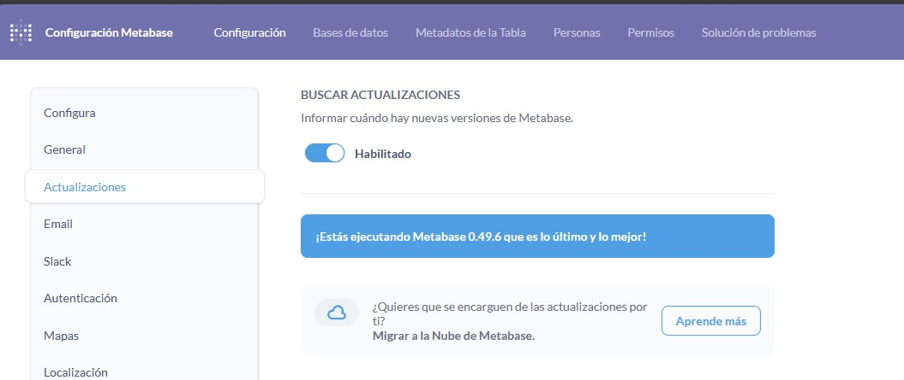

# metabase-update

Desarrollado por Duban Moreno
dubanfelipem@gmail.com

Este script automatiza actualizar el .jar de metabase a la versión que se le indique.

Pasos para correr el script
1. Consultar en tu metabase si hay actualizaciones 
   

2. Ejecución del script de la siguiente manera: 

    `Usage: sudo ./updatemetabase.sh <backup_suffix> <metabase_version>`

    `Example: sudo ./updatemetabase.sh bk.v0.49.3 v0.49.6`